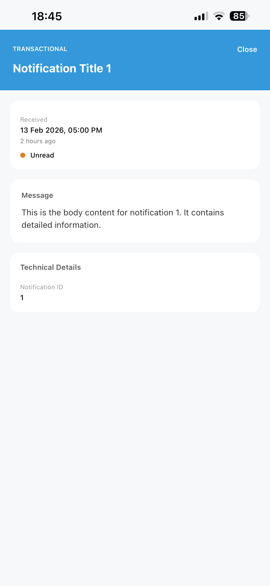
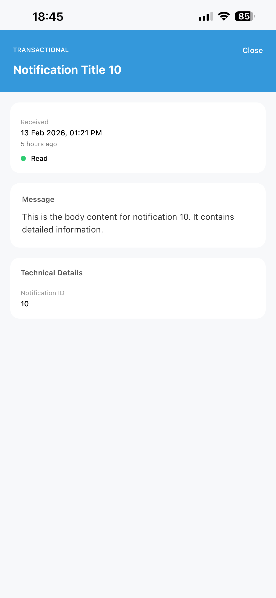
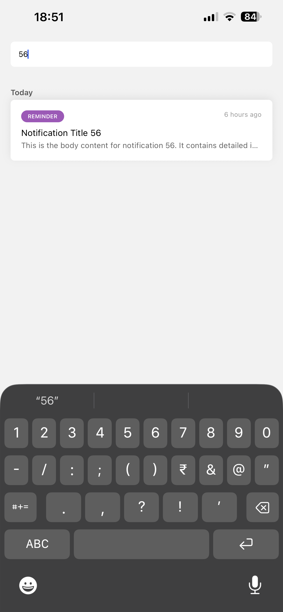

# Task 3 - React Native Notification App

## Install

~~~
npm install
~~~
---
## Run

#### 1. Start the server
~~~
npm start
~~~
OR
~~~
npx expo start
~~~

#### 2. Scan QR in terminal with Expo Go app on Ios/android mobile.
---

## Features

- 100 mock notifications
- 300ms simulated network delay
- Search with 400ms debounce
- Infinite scroll pagination
- Modal detail view
- Type badge (color-coded)
- Relative timestamps
- Smooth scrolling via **Sectionlist** instead of Flatlist to segregate onto 'Today', 'Yesterday' and 'Earlier' sections.
- Unread notifications are highlighted with color coded border. Clicking open a notification **changes its 'isRead' status** from *false* to *true*.
- Notification Skeletons while loading more on scroll.

## Technical Decisions

- Used Infinite Scroll for better UX.
- Expo Router for simplified navigation.
- useMemo for optimized search filtering.
- Debounce hook to prevent excessive re-renders.

## Screenshots

